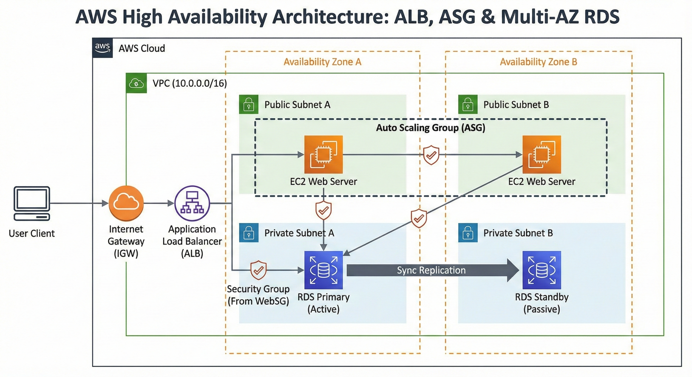

# AWS 2-Tier High Availability Architecture (Infrastructure as Code)

## 🌟 Overview
This repository contains Terraform code to deploy a fully automated, scalable, and highly available 2-tier architecture on AWS. The design follows cloud best practices for security, availability, and fault tolerance.

## 🏗️ Architecture Diagram


## 🚀 Key Features
- **High Availability:** Infrastructure spread across multiple Availability Zones (AZs).
- **Scalability:** Auto Scaling Group (ASG) automatically manages EC2 instances based on demand.
- **Load Balancing:** Application Load Balancer (ALB) acts as the single entry point, distributing traffic efficiently.
- **Data Persistence:** Multi-AZ Amazon RDS (MySQL) for automatic failover and data redundancy.
- **Security-First Design:** 
  - Web servers are isolated from the public internet (accessible only via ALB).
  - Database is hidden in private subnets, accepting traffic only from web servers.
  - Granular Security Groups acting as virtual firewalls.

## 🛠️ Technology Stack
- **Provider:** AWS
- **IaC Tool:** Terraform
- **Languages:** HCL (HashiCorp Configuration Language), Bash (User Data scripts)
- **Services:** VPC, EC2, RDS, ALB, ASG, Internet Gateway, Route Tables.

## 📋 Prerequisites
- [Terraform](https://www.terraform.io/downloads.html) installed.
- AWS Account and configured CLI credentials.

## 🔧 How to Deploy
1. **Clone the repo:**

    ```bash
    git clone <your-repo-url>
    ```

2. **Initialize Terraform:**

    ```bash
    terraform init
    ```

3. **Configure Variables:**
    Create a `terraform.tfvars` file and define your database password:

    ```hcl
    db_password = "your_secure_password"
    ```

4. **Deploy:**

    ```bash
    terraform apply
    ```

## 🧹 Cleanup
To avoid ongoing AWS charges, destroy the infrastructure after testing:

    ```bash
    terraform destroy
    ```